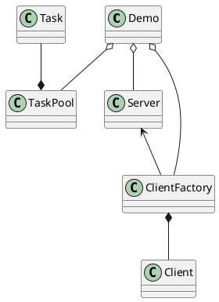

# Function

1. working as server
2. compose a resp with request, server A resp and serverB resp
3. Server A use short connection and Server B use long connection

# class

```plantuml
@startuml
class Demo
class TaskPool
class Task
Task --* TaskPool
class Server
class Client
class ClientFactory
ClientFactory *-- Client
Demo o-- ClientFactory
Demo o-- Server
Demo o-- TaskPool
Server <-- ClientFactory
@enduml
```