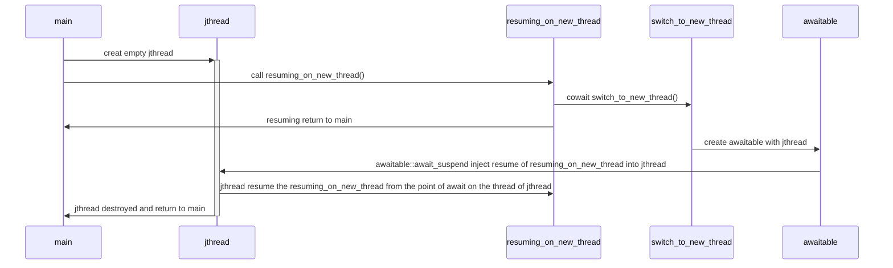

# coroutine base

## call relationship

```mermaid
sequenceDiagram
    main ->>+ jthread: creat empty jthread
    main ->> resuming_on_new_thread: call resuming_on_new_thread()
    resuming_on_new_thread ->> switch_to_new_thread: cowait switch_to_new_thread()
    resuming_on_new_thread ->> main: resuming return to main
    switch_to_new_thread ->> awaitable: create awaitable with jthread
    awaitable ->> jthread: awaitable::await_suspend inject resume of resuming_on_new_thread into jthread
    jthread ->> resuming_on_new_thread: jthread resume the resuming_on_new_thread from the point of await on the thread of jthread
    jthread ->>- main: jthread destroyed and return to main
```