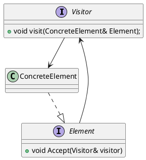

# target

1. custom action to elment

# UML

```puml
@startuml
interface Visitor{
    +void visit(ConcreteElement& Element);
}
interface Element {
    +void Accept(Visitor& visitor)
}
class ConcreteElement

ConcreteElement ..|> Element
Visitor --> ConcreteElement
Element --> Visitor

@enduml
```