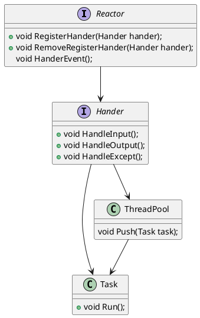

# reactor

```puml
@startuml
interface Reactor {
    +void RegisterHander(Hander hander);
    +void RemoveRegisterHander(Hander hander);
    void HanderEvent();
}

interface Hander {
    + void HandleInput();
    + void HandleOutput();
    + void HandleExcept();
}

Reactor --> Hander

class Task {
    +void Run();
}

class ThreadPool {
    void Push(Task task);
}

ThreadPool --> Task

Hander --> ThreadPool
Hander --> Task

@enduml
```